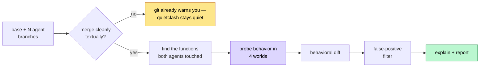
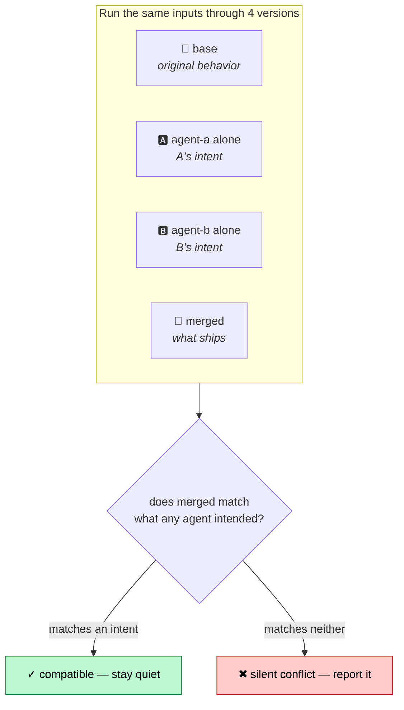

<div align="center">

# quietclash

### Catch the conflicts your merge tool can't see.

When parallel AI agents edit your codebase, some of their changes **merge cleanly, pass every test — and still break at runtime.** `quietclash` runs the code and proves it.

[](https://www.npmjs.com/package/quietclash)
[](https://github.com/arbade/quietclash/actions)
[](./LICENSE)
[](https://nodejs.org)
[](#scope--honest-limits)

</div>

---

## The problem nobody is catching

You run several AI coding agents in parallel — each in its own git branch or worktree. One writes the pricing logic, another touches a caller, a third refactors a helper. Then you merge.

Git checks one thing: **did two changes touch the same lines of text?** If not, it reports a clean merge and waves you through. But git has no idea whether two changes that *don't* overlap textually are compatible in **meaning**.

> **They often aren't.** A measured **5–10%** of parallel-agent merges are textually clean and test-passing yet behaviorally broken ([CodeCRDT, arXiv:2510.18893](https://arxiv.org/abs/2510.18893)).

This is exactly why teams that adopt AI heavily ship **+98% more PRs** but spend **+91% longer in review** — with no net throughput gain ([Faros AI, 2026](https://www.faros.ai/blog/ai-software-engineering)). Generating code is solved. **Trusting the merge is not.**

```diff
- git:        "No conflicts. Safe to merge." ✓
+ quietclash: "formatTotal() now returns $4200.00 where the author meant $42.00." ✗
```

Most tools in this space read the diff or ask an LLM to *guess*. `quietclash` instead **executes the code and compares behavior** across each branch — so a flagged conflict comes with a concrete input that reproduces it, not a hunch.

| | git merge | CI tests | Static analysis / LLM review | **quietclash** |
|---|:---:|:---:|:---:|:---:|
| Catches textual conflicts | ✅ | — | partial | defers to git |
| Catches a behavior that matches *neither* agent's intent | ❌ | only if you wrote the exact test | guesses | ✅ **runs it** |
| Gives a reproducing input | ❌ | ✅ | ❌ | ✅ |
| Needs you to have written a test for it | — | ✅ | ❌ | ❌ |

---

## See it

```console
$ quietclash check --base main --branches agent-a,agent-b

Two agents worked in parallel. Their branches merge with NO git conflict:

  $ git merge agent-a agent-b   →   clean merge, no conflicts ✓

But quietclash runs the code and sees what git can't:

✖ 1 silent behavioral conflict found — these branches merge cleanly and pass
  tests, but behave in ways no agent intended.

  formatTotal  (price.mjs)
    what: one branch changed a function this caller relies on; the caller now
          behaves differently than intended
    evidence: diverged on 5/24 probe inputs
      e.g. input ["42"] → base=(n/a) | A=$42.00 | B=$42.00 | merged=$4200.00
    why:  Agent A changed parsePrice to return cents; Agent B's new formatTotal
          still assumes dollars. They merge cleanly and break on every price.
```

> Reproduce it yourself: [`bash examples/demo.sh`](./examples/demo.sh)

---

## How it works

`quietclash` doesn't read your code — it **runs** it, in four parallel "worlds," and compares what each function actually *does*.



The four worlds are the heart of it. For every symbol that two agents touched, `quietclash` asks: *what did this function return before, what did each agent intend, and what does the merged result actually do?*



It detects two kinds of clash:

| Kind | What happens | Example |
|------|--------------|---------|
| **Direct** | Two agents change the *same* function; the merge interleaves them into behavior neither wrote. | A makes `score` double its input, B makes it add 10 → merged does `(x*2)+10`. |
| **Contract** | One agent changes *what a function returns or expects* (its "contract"); another adds code that calls it assuming the **old** behavior. | A makes `parsePrice` return cents; B's new `formatTotal` still formats it as dollars. |

> **Jargon, once:** a function's *contract* is the promise it makes to callers — what it takes in and what it gives back. *Behavioral diff* just means "run both versions on the same inputs and compare the outputs." That's the whole trick.

### Why "run it" instead of "read it"

Static analysis and LLM review look at the text and *guess*. `quietclash` synthesizes inputs, executes each version in an isolated subprocess, and compares real outputs — so a "conflict" is a demonstrated behavioral divergence, with a reproducing input attached, not a hunch.

The hardest part is **not crying wolf.** A behavioral probe that flags every reformat or non-deterministic function is useless. `quietclash` filters those out (refactoring-aware comparison, non-determinism detection, low-signal suppression) — the same false-positive problem the academic state of the art exists to solve.

---

## Is this for you?

> Use `quietclash` if you **run two or more AI agents in parallel** on a JavaScript/TypeScript repo and merge their branches. It's the check you run right before (or instead of trusting) that merge.

## Where it fits with Claude Code (and Cursor, Codex, …)

`quietclash` is **agent-agnostic** — it doesn't plug *into* your agent, it inspects the **git branches** your agents produce. So it works the same whether those branches came from Claude Code, Cursor, Codex, or your own hands. It runs **after** the agents finish, right before you merge.

A typical Claude Code flow:

```bash
# 1. You run agents in parallel — each on its own branch / git worktree.
#    (Claude Code agent teams, multiple sessions, or git worktrees — your choice.)
git worktree add ../work-a -b agent-a     # Claude Code session A works here
git worktree add ../work-b -b agent-b     # Claude Code session B works here

# 2. Both finish. Their branches merge cleanly — git is happy.
#    But did they silently break each other? Check before you trust it:
quietclash check --base main --branches agent-a,agent-b

# 3. Act on the result, then merge.
```

Think of it as the **verification step** at the end of a parallel-agent run — the thing that answers "these merged without a git conflict, but can I actually trust the result?"

### Use it as a Claude Code plugin (`/quietclash`)

Prefer to stay inside Claude Code? quietclash also ships as a plugin that adds a
`/quietclash` slash command. It calls the same CLI engine under the hood, then
reads the structured result back to you in plain language — including which base
and branches it picked when you don't name them.

```text
# In Claude Code, add this repo as a plugin marketplace, then install:
/plugin marketplace add arbade/quietclash
/plugin install quietclash@quietclash

# Then, after a parallel-agent run:
/quietclash main agent-a agent-b
# or just /quietclash — it will discover your recent branches and tell you
# which two it compared.
```

The CLI and the plugin are the **same tool**: the plugin is a thin wrapper that
runs `quietclash check --json` and interprets the output. Nothing is
reimplemented, so both stay in sync.

## Install

```bash
npm install -g quietclash        # or run ad-hoc with: npx quietclash
```

Requires **Node ≥ 22** (for TypeScript type-stripping; ≥18 works for plain JS) and `git`. The LLM explanation step is optional — set `ANTHROPIC_API_KEY` to get a plain-language "why," otherwise you get a structural explanation for free.

## Step by step: your first run

New to this? Here's the whole thing from zero, no prior context assumed.

**Step 1 — Install it.**

```bash
npm install -g quietclash
quietclash --help          # confirms it's installed
```

**Step 2 — Have two branches to compare.** You already do if you ran two agents in parallel. If you just want to *see it work*, run the bundled demo, which builds a tiny repo with a real conflict and checks it for you:

```bash
git clone https://github.com/arbade/quietclash
cd quietclash && npm install
bash examples/demo.sh        # builds a demo repo + runs quietclash on it
```

**Step 3 — Run the check on your own repo.** From inside your project (or with `--cwd` pointing at it), give it the branch the agents started from and the two agent branches:

```bash
cd my-project
quietclash check --base main --branches agent-a,agent-b
```

- `--base` → the branch/commit both agents branched *from* (often `main`).
- `--branches` → the two agent branches you're about to merge, comma-separated.

**Step 4 — Read the result.** One of three things happens:

| You see | It means | Do this |
|---|---|---|
| `✓ No silent behavioral conflicts detected` | The branches behave compatibly where they overlap. | Merge with more confidence. |
| `✖ N silent behavioral conflict(s) found` | A merged function behaves like neither agent intended. | See [**When it fires**](#when-it-fires--what-to-do) below. |
| `⚠ Branches do not merge cleanly` | Git already sees a textual conflict. | Resolve that first; quietclash adds nothing here. |

**Step 5 — When it flags something, zoom in.** Get the full evidence for one function:

```bash
quietclash explain formatTotal --base main --branches agent-a,agent-b
```

That's it. No config files, no setup. Below is the full command reference.

## Usage

```bash
# Check whether two agent branches silently clash
quietclash check --base main --branches agent-a,agent-b

# Point at any repo
quietclash check --base main --branches feat-x,feat-y --cwd ../my-project

# Machine-readable output for CI
quietclash check --base main --branches a,b --json

# Deep-dive a single conflicting symbol
quietclash explain formatTotal --base main --branches agent-a,agent-b

# Run the benchmark (precision / recall on a labeled suite)
quietclash bench
```

### When it fires — what to do

`quietclash` **detects, it does not fix.** When it flags a conflict, it's telling you two agents made changes that combine into behavior neither intended — with a reproducing input. Your options:

1. **Read the evidence.** The reproducing input (e.g. `["42"] → merged=$4200.00`) usually makes the bug obvious.
2. **Pick a winner.** Decide whose behavior is correct and pin it with a test, so it can't silently regress again.
3. **Re-prompt the agent** that broke the contract, now that you know exactly which function and which input.
4. **Or revert** the conflicting change and redo it with the other change in context.

### CI gating

`check --json` emits a stable schema (`schemaVersion`, `summary`, `conflicts[]`, `skipped[]`) you can gate a merge on. Drop it into a pre-merge job to block silent conflicts before they land.

---

## Proof: the benchmark

Every claim here is only as good as its false-positive rate, so `quietclash` ships a labeled benchmark you can run yourself:

```console
$ quietclash bench

  TP ✓ caught   double-vs-add (same fn, far-apart lines, combined ≠ either)
  TP ✓ caught   scale clash (A×100 vs B rounds — order changes result)
  TP ✓ caught   guard clash (A clamps low, B negates — non-commutative)
  TP ✓ caught   broken contract (A→cents, B adds dollar-assuming caller)
  TN ✓ quiet    independent functions (no shared symbol)
  TN ✓ quiet    compatible identical change
  TN ✓ quiet    only one agent touches the symbol
  TN ✓ quiet    pure reformat vs real change
  TN ✓ quiet    compatible contract (caller unaffected)

  TP=4 TN=5 FP=0 FN=0  |  precision=1.0  recall=1.0
```

> On this **labeled suite that ships in the repo** (`bench/scenarios.js`), quietclash flagged every planted behavioral conflict and stayed quiet on every clean merge. It's a **starting harness, not a leaderboard** — the honest read is "it works on these cases." Bring adversarial scenarios; a PR that breaks it is the most useful PR you can send.

---

## Scope & honest limits

`quietclash` is deliberately narrow so it can be *trustworthy* inside its lane:

- **Language:** JavaScript & TypeScript (`.js`, `.mjs`, `.ts`, `.tsx`, …). TypeScript runs via Node's built-in type-stripping (Node ≥ 22). Other languages: roadmap.
- **Async:** supported — async functions are awaited and compared on their resolved value.
- **Granularity:** pairwise (two branches) in v0; N-way is roadmap.
- **What it probes well:** pure and near-pure functions. When synthesized inputs can't exercise a symbol meaningfully (e.g. it needs a specific domain object) or it's I/O-bound, it's reported as **skipped (unobservable)** — *never* silently passed as "clean." Honesty over false confidence.
- **Safety:** probed code runs in a child process with filesystem-write and `child_process` calls blocked, so a probed function can't damage your machine. It's a guard rail, not a hardened sandbox — don't point it at deliberately malicious code.
- **What it is not:** a runner/orchestrator. It's the *verification* layer that runs **after** your agents finish — complementary to tools that spawn and manage them.

## Roadmap

- [ ] Python & Go support
- [ ] N-way conflict detection (3+ branches)
- [ ] GitHub Action for pre-merge gating
- [ ] Plugin hooks for popular agent orchestrators

## Prior art it builds on

- **CodeCRDT** — [arXiv:2510.18893](https://arxiv.org/abs/2510.18893) — measured the 5–10% silent-conflict rate; the framing behind the benchmark.
- **SAM — Detecting Semantic Conflicts with Unit Tests** — [paper](https://spgroup.github.io/papers/sam-semantic-merge-tool.html) — the test-synthesis approach.
- **RefFilter** — [arXiv:2510.01960](https://arxiv.org/abs/2510.01960) — refactoring-aware false-positive reduction.

## Contributing

Issues and PRs welcome. Run the suite with `npm test` (26 tests) and the benchmark with `npm run bench`. New conflict patterns are best contributed as labeled scenarios in `bench/scenarios.js`.

## License

[MIT](./LICENSE) © arbade
